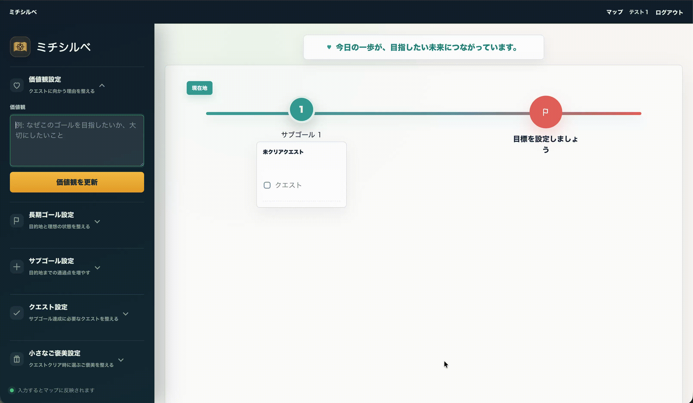
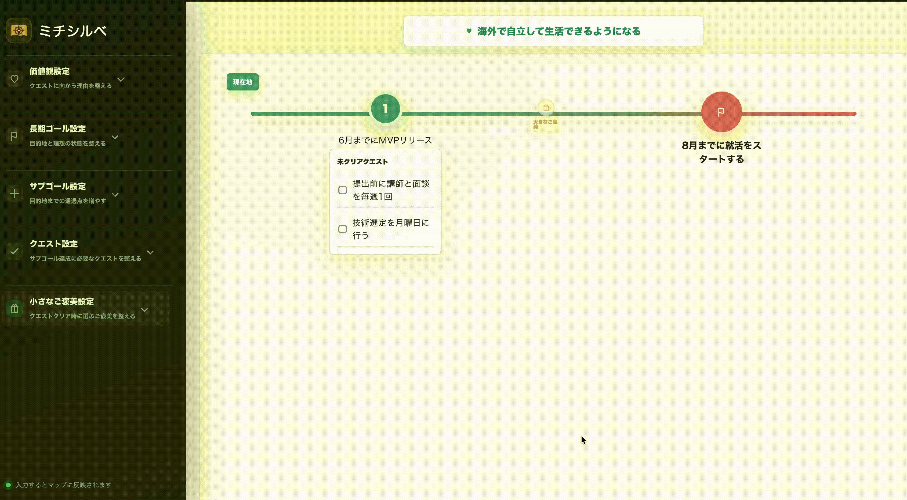
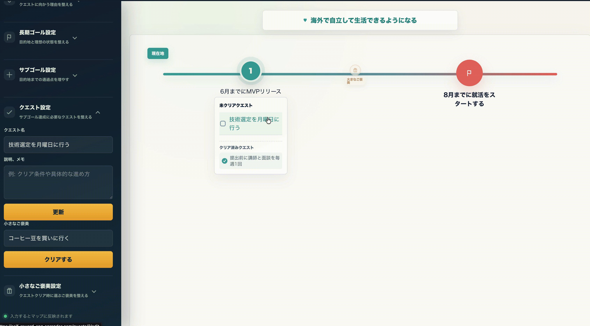

## 背景

このサービスを思いついたきっかけは、私自身の体験です。
特に、真面目に学習を続けようとするほど疲れてしまう人に向けたサービスにしたいと考えています。

私自身、これまで学生から社会人時代、ワーホリ時代を通して仕事終わり、休日、隙間時間に学習をしてきました。
現在もRUNTEQでアルバイトをしながら学習をしています。

少しの隙間時間や休みを有効に活用するために、Excelやノートを利用して学習計画を作成することで「学習行動を継続させるための工夫」を続けてきました。

中でも、私自身がゲーム好きだったこともあり、ゲーミフィケーションの考え方には特にお気に入りな手法です！

例えば、

```
Excelで目標や1週間ごとの成果を数値化
⇩
目標達成したら
⇩
スマホのTODOにリストアップしたご褒美を獲得
```

といったゲームの要素を取り入れて学習を継続してきました。

しかし、TODOアプリ、Excelなどのツールを利用したタスク管理の場合、課題として

```
学習管理をするサービスが複数に分かれている
⇩
- 目的・タスク・報酬のつながりが見えにくい
- 管理する心理的負担や手間がある
⇩
ゲーミフィケーションの手法が続かない
```

といった課題があったり

また、考えすぎかつ、少し完璧主義な私の場合、
疲れている時に設定したTODOや目標が達成できなかったりする「罪悪感や自責の念」を感じることも多々ありました。

進捗が遅れている時は、小さな課題をクリアしても「次、次」と考えてしまい、自分を労ることを忘れてしまうことがあり、
その結果、疲れを感じたり、前に進んでいる実感が持てず焦りを感じたりすることもありました。

そのため、1つのサービス上で長期的な学習に対する「価値観」「長期ゴール」「サブゴール」「クエスト」「ご褒美」を管理できれば、学習の目的を見失わず、心理的負担を減らせるなという仮説のもと

完璧主義で真面目気質な人が使っても、心理的に負担が少ない設計を目指したMVPです。


## ミチシルベ 使い方説明書

使い方の基本は、次の順番。

1. 価値観を設定
2. 長期ゴールを設定
3. サブゴールを設定
4. クエストを設定
5. クエスト達成時に選ぶ「小さなご褒美」を用意
6. クエストをクリアして、小さなご褒美を選ぶ
7. サブゴール内のクエストをすべてクリアして、「大きなご褒美」を獲得

## 1. 価値観を設定する

価値観は、「なぜこのゴールを目指したいのか」「何を大切にしながら進みたいのか」を書く場所です。

設定方法:



## 2. 長期ゴールを設定する

長期ゴールは、最終的にたどり着きたい目的地です。大きすぎる夢ではなく、「達成できたかどうかが自分で判断できる状態」にすると使いやすくなります。


設定方法:


## 3. サブゴールを設定する

サブゴールは、長期ゴールまでの途中に置くマイルストーンとして活用。長期ゴールをいきなり目指すのではなく、事前に考えたいくつかの段階に分けることで、次に何をすればよいかが分かりやすくなるように設定します。

設定方法:


サブゴールは最大5つまで追加できます。

## 4. クエストを設定する

クエストは、サブゴールを達成するための具体的な行動です。「今日やること」「短い時間で終わる作業」くらいまで小さくすると、クリアしやすくなります。

設定方法:


追加したクエストは、選んだサブゴールの下に表示されます。未クリアのクエストとクリア済みのクエストは、マップ上で分かれて表示されます。

## 5.小さなご褒美をリストアップ

クエストをクリアするときには、「小さなご褒美」を選べます。小さなご褒美は、毎日の行動を続けるための軽い報酬です。

設定方法:



小さなご褒美は複数登録できます。クエストをクリアするときに、その中から1つ選びます。


## 6. クエストをクリアして小さなご褒美を選ぶ


クエストが終わったら、マップ上のクエストを開いてクリアします。



クリアしたクエストは「クリア済みクエスト」として表示されます。選んだ小さなご褒美も、そのクエストに記録されます。

間違えてクリアした場合は、クエストを開いて「未クリアに戻す」を押すと戻せます。

## 7. サブゴール達成後に大きなご褒美を獲得する

サブゴールに紐づくクエストをすべてクリアすると、そのサブゴールは達成状態になります。達成すると、サブゴールに設定していた「大きなご褒美」を獲得できます。


獲得後は、ご褒美ポイントが「獲得済み」として表示されます。

大きなご褒美は、サブゴールごとに設定します。小さなご褒美より少し特別なものにすると、区切りとして分かりやすくなります。
