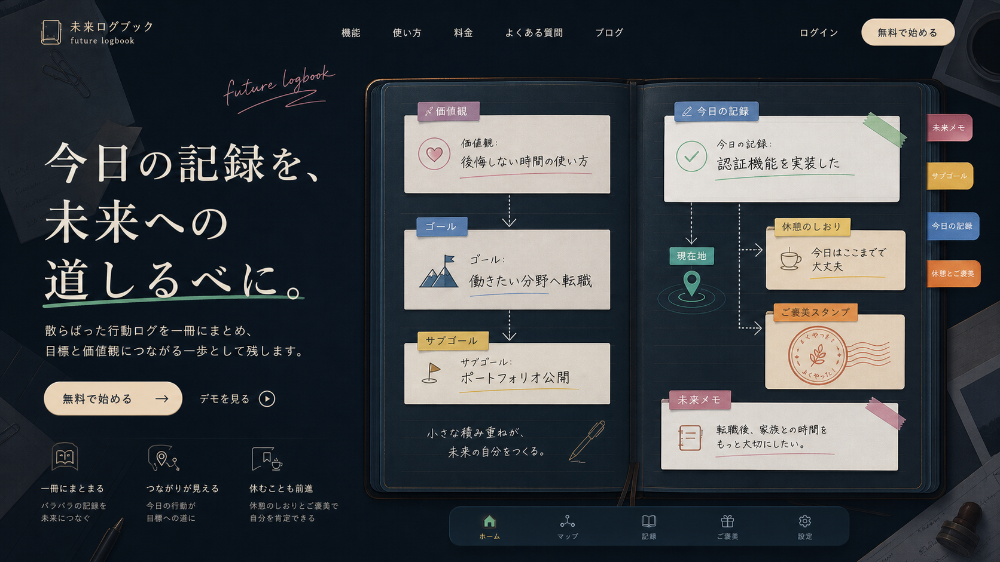

# Future Logbook / 未来につながる航海記録

## コンセプト

散らばった行動ログを、未来につながる1冊のログブックにまとめる案。

Excel、Notion、Todo、カレンダーに分かれていた管理を、単なる記録ではなく「今日の行動が価値観・ゴール・サブゴールへどうつながるか」を残す体験として再設計する。

## 実体験との接続

- Excelで学習ログを管理していた
- NotionやTodoでご褒美やタスクを別々に管理していた
- 複数ツールを行き来するのが面倒で、ご褒美システムが機能しなくなった
- 日々の積み重ねを、自分の未来につながる記録として残したい

## UIの役割

- 価値観: ログブックの最初に書かれた理由
- ゴール: 目的地ページ
- サブゴール: 章、しおり、ページタブ
- 今日の行動: 今日の記録カード
- 現在地: 開いているページ上のマーカー
- 休憩地点: ページを閉じる前のしおり
- ご褒美: 自分を認めるスタンプ

## カラーパレット

| 用途 | HEX |
| --- | --- |
| 背景 | `#151923` |
| 背景グラデーション | `#253143` |
| パネル | `#1D2838` |
| パネル薄色 | `#314054` |
| 文字 | `#F3EFE2` |
| 補足文字 | `#AFAEA6` |
| 現在地 | `#5FD19A` |
| ゴール | `#6B9DD6` |
| サブゴール | `#DDC15E` |
| 休憩・ご褒美 | `#D08A42` |
| 価値観 | `#B47694` |
| 境界線 | `#46566B` |

## トンマナ

- 静かな記録
- 航海日誌、未来への手紙
- 手書き線、しおり、スタンプ
- 管理ではなく、意味づけの記録

## 検証観点

- Notionや日記アプリに見えすぎていないか
- 行動ログが「作業記録」ではなく、未来への接続として見えるか
- ご褒美スタンプが報酬ではなく、自分を認める区切りに見えるか
- 毎日重い文章を書かないといけない印象になっていないか
