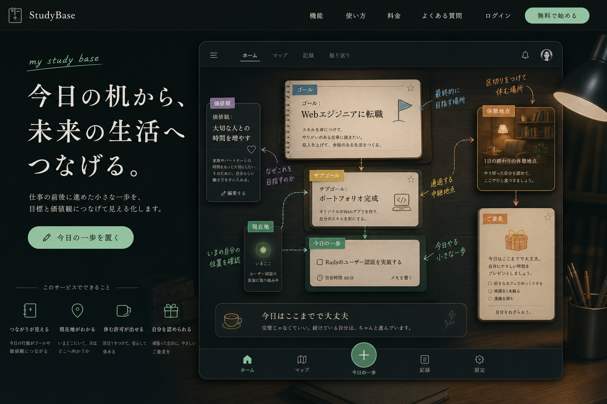

# Study Base / 生活の中の学習拠点

## コンセプト

働きながら学ぶ日常の中に、小さな学習拠点を作る案。

ユーザーは大きな旅に出るのではなく、仕事の前後や休憩時間に机へ戻り、今日の一歩を未来の生活へつなげる。目標、価値観、サブゴール、今日の行動を「机の上の学習ボード」として表現する。

## 実体験との接続

- 週4で働きながら学習していた体験
- 出勤前、仕事終わり、休憩時間、休日の図書館で学ぶ生活
- 学習後も切り替えられず、うまく休めない感覚
- 小さなご褒美で自分を労りたい体験

## UIの役割

- 価値観: なぜ学ぶのかを示すカード
- ゴール: 机の上に置かれた大きな目的カード
- サブゴール: 途中の章や付箋
- 今日の行動: 今日開くカード
- 現在地: いま取り組んでいる場所
- 休憩地点: 1日の終わりの安心できる場所
- ご褒美: 休む許可を出す小さな楽しみ

## カラーパレット

| 用途 | HEX |
| --- | --- |
| 背景 | `#18211F` |
| 背景グラデーション | `#2C3A35` |
| パネル | `#20332D` |
| パネル薄色 | `#334A42` |
| 文字 | `#F4F1E8` |
| 補足文字 | `#B6B2A8` |
| 現在地 | `#70D6A1` |
| ゴール | `#6BA6B8` |
| サブゴール | `#E0C75A` |
| 休憩・ご褒美 | `#C9874A` |
| 価値観 | `#A47BA8` |
| 境界線 | `#50645D` |

## トンマナ

- 静かな夜の机
- 図書館やカフェのような集中感
- 暗いが温かい
- 休憩が自然に受け入れられる

## 検証観点

- 働きながら学ぶ人の日常に寄り添って見えるか
- ただのTodoボードではなく、価値観との接続が見えるか
- 休憩地点が「サボり」ではなく、区切りとして見えるか
- 生活感が強すぎてゴールへの道筋が弱くなっていないか
