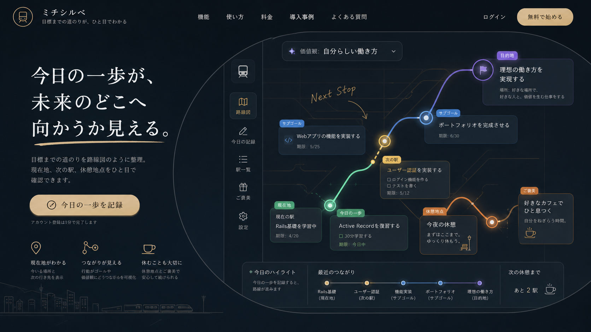

# Transit Map / 目的地へ向かう路線図

## MVPページ画像

| ページ | 画像 | 役割 |
| --- | --- | --- |
| ホーム / 目標マップ | [ui.png](./ui.png) | 現在地、次の駅、サブゴール、目的地、休憩地点を全体で確認する |
| 初期設定 / 路線作成 | [pages/onboarding.png](./pages/onboarding.png) | 価値観、目的地、途中駅、今日の一歩、休憩地点を設定する |
| 今日の一歩 | [pages/today.png](./pages/today.png) | 今日進める一駅だけを記録し、どこにつながるか確認する |
| 休憩地点 / ご褒美 | [pages/rest.png](./pages/rest.png) | 今日進んだ区間を確認し、安心して休む区切りを作る |

## コンセプト

目標達成を「目的地へ向かう移動」として表現する案。

ユーザーはタスクを消化するのではなく、自分がどの路線に乗っていて、次にどの駅へ向かうのかを確認する。現在地、今日の一歩、サブゴール、休憩地点、ご褒美、目的地を路線図として接続する。

## 実体験との接続

- ロンドンでの英語学習、プログラミング学習
- 新しい環境へ行くために学び続けていた体験
- キャリアアップ、転職、働きたい分野へ移動する感覚

## UIの役割

- 価値観: 路線全体の方向性
- ゴール: 目的地の駅
- サブゴール: 途中駅、乗り換え地点
- 今日の行動: 次の駅まで進む区間
- 現在地: いま点灯している駅
- 休憩地点: 途中で立ち寄る場所
- ご褒美: 休憩地点で受け取る小さな肯定

## カラーパレット

| 用途 | HEX |
| --- | --- |
| 背景 | `#121A20` |
| 背景グラデーション | `#243540` |
| パネル | `#192833` |
| パネル薄色 | `#2D4654` |
| 文字 | `#F2F5F2` |
| 補足文字 | `#A8B5B8` |
| 現在地 | `#58C98B` |
| ゴール | `#5FA8D3` |
| サブゴール | `#E1B955` |
| 休憩・ご褒美 | `#D58B45` |
| 価値観 | `#8E7BD1` |
| 境界線 | `#3D5863` |

## トンマナ

- 都市的
- 夜の駅のように静か
- 情報は少なく、現在地と次の行き先を明確にする
- 手書き風の補助ラベルで管理画面っぽさを弱める

## 検証観点

- 現在地と目的地が直感的に分かるか
- サブゴールが途中駅として自然に見えるか
- 交通アプリに見えすぎず、目標達成サービスとして伝わるか
- 休憩地点とご褒美が「寄り道」ではなく、安心して休む区切りに見えるか
